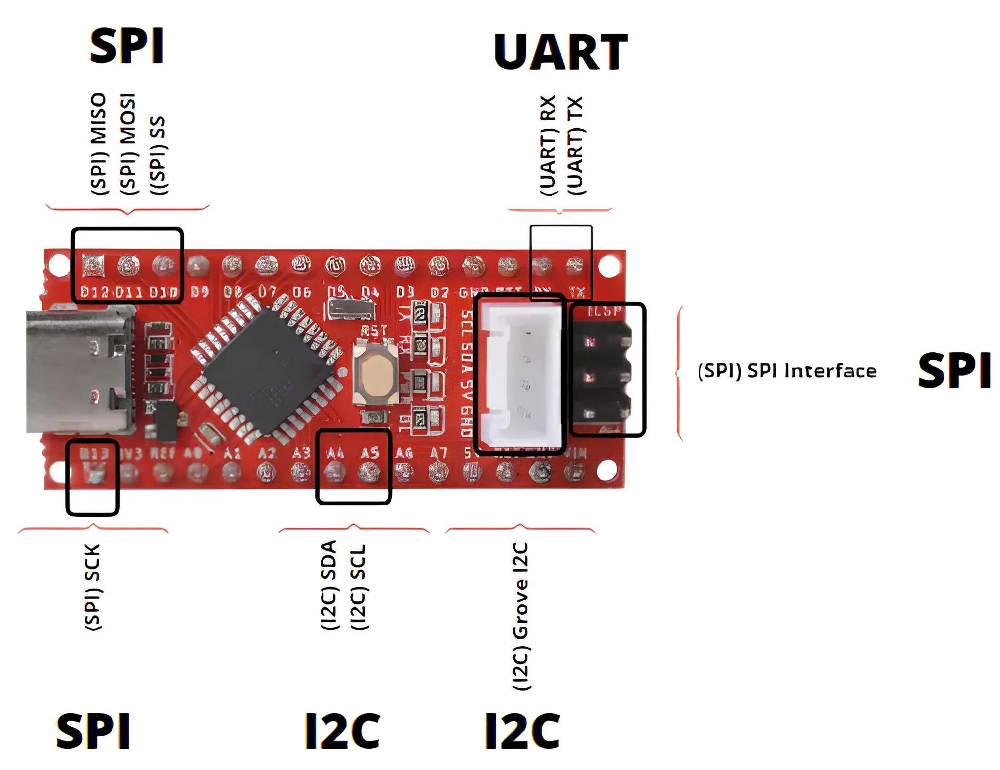

<!--   
# Protocolos de Comunicação : I2C, SPI, UART

##  

### Autores
- João Pedro Freitas de Paula Dias
- João Gustavo Silva Guimarães
- João Marcos Silva Hess
- João Marcelo Gonçalves Lisboa
-->

<section class="lead transparent">

Protocolos de Comunicação : I2C, SPI, UART

<!-- -->

 •João Pedro Freitas de Paula Dias

 •João Gustavo Silva Guimarães
  

 •João Marcos Silva Hess

 •João Marcelo Gonçalves Lisboa

