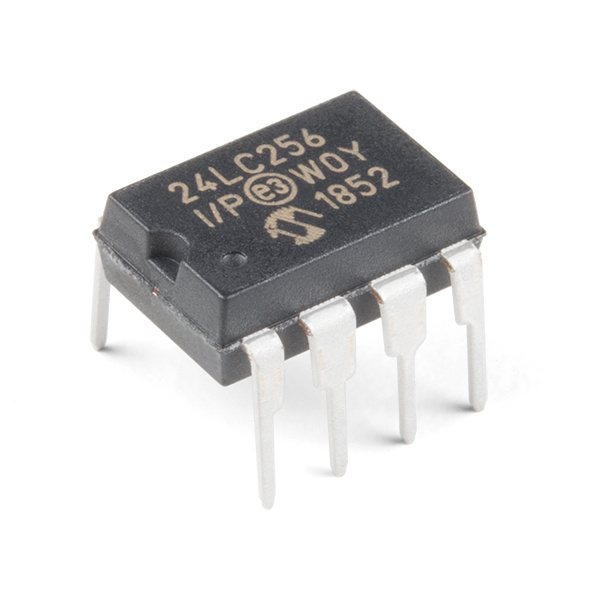
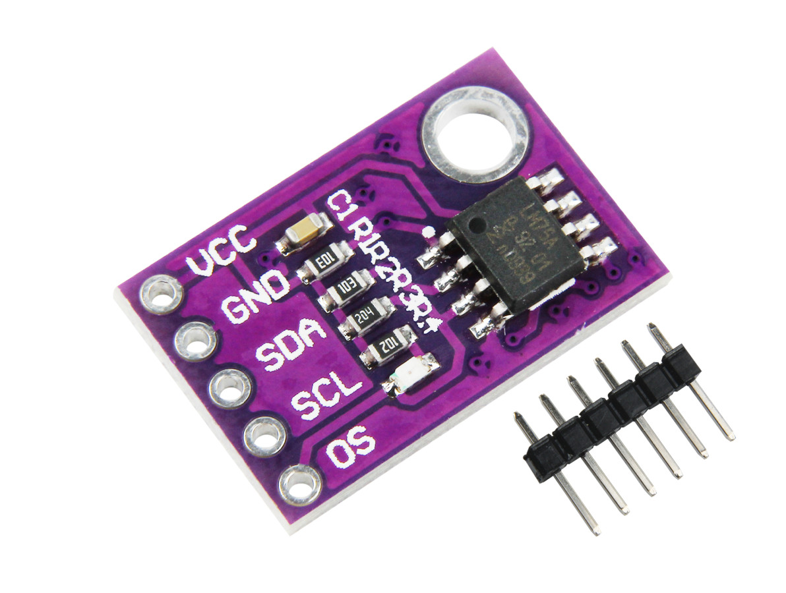

<section>
  
Aplicações – Protocolo I²C

  

    

      
Caso de Uso 1  Acesso e leitura de EEPROMS

      
    

    

      
Caso de Uso 2  Gerenciamento de sensores

      
    

  

</section>
