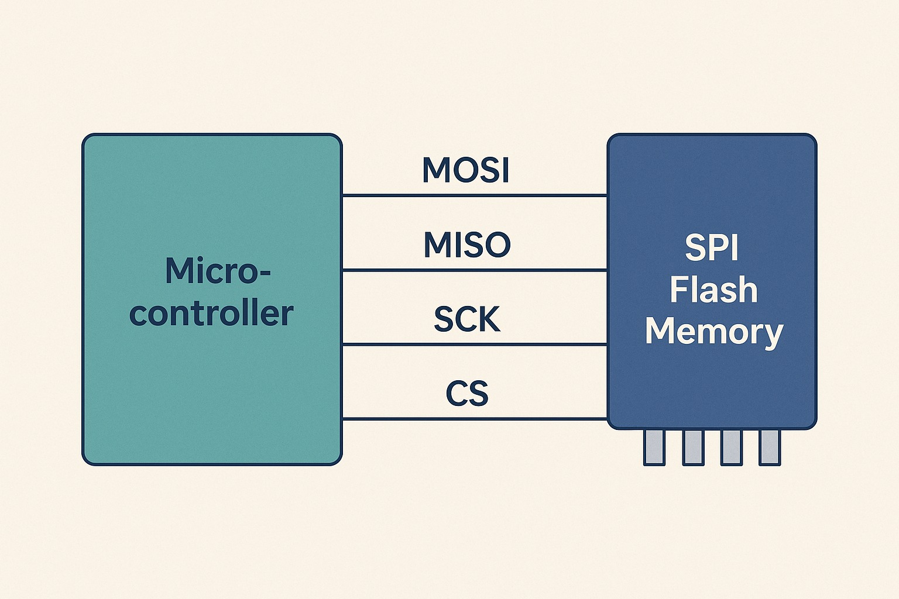

<section>
  
Aplicações - Protocolo SPI

  

    

      
Caso de uso 1: Comunicação com memória Flash

      <ul class="small">
        <li>Muitos microcontroladores utilizam SPI para se comunicar com chips de memória não-volátil (ex.: <em>W25Q64</em>).</li>
        <li>Permite leitura e escrita rápida de dados.</li>
      </ul>
      
    

    

      
Caso de uso 2: Display OLED com microcontrolador

      <ul class="small">
        <li>Exemplo: Usar um <em>display OLED SPI 128x64</em> com um Arduino ou ESP32.</li>
        <li>O protocolo SPI permite atualização rápida das imagens no display, ideal para interfaces de usuário.</li>
      </ul>
      
    

  

</section>
