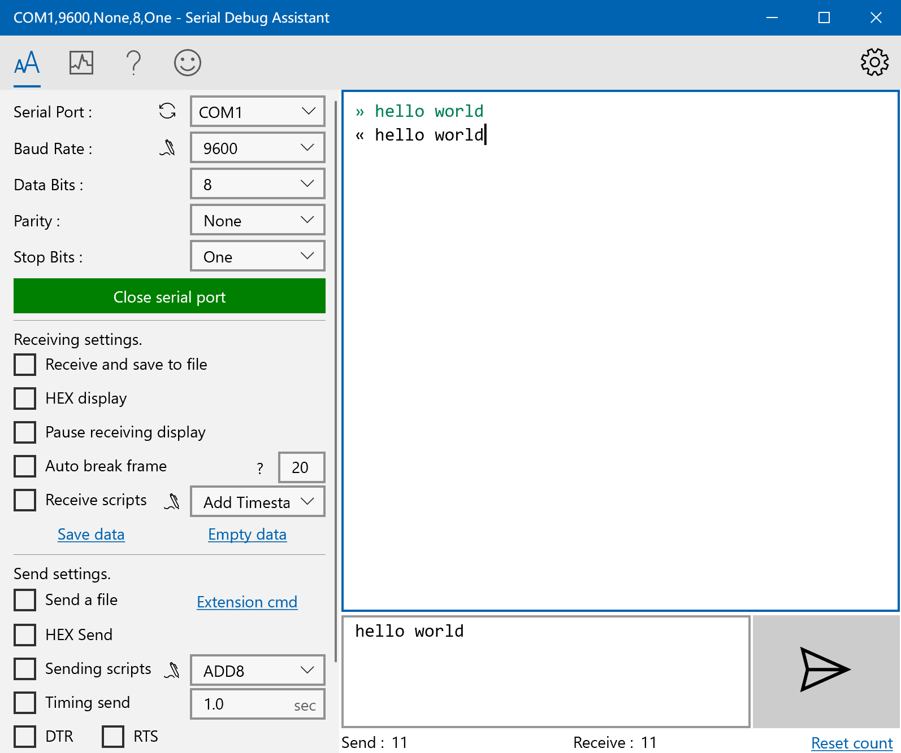

<section>
  
Aplicações - Protocolo UART

  

    

      
Caso de Uso 1: Comunicação com Módulos Bluetooth ou Wi-Fi

      
    

    

      
Caso de Uso 2: Depuração de Código e Monitoramento Serial

      
    

  

</section>
